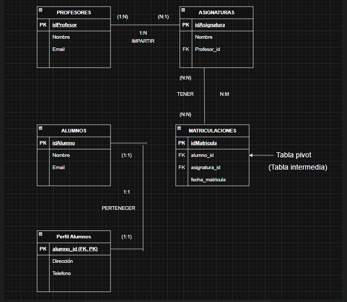

# Práctica UD3: Base de Datos Relacionales con Laravel

## 1. Descripción del problema

Supongamos que la Escuela Técnica “San Vicente” necesita un sistema para gestionar la información de profesores, alumnos y asignaturas que se imparten. Actualmente, manejan muchos datos en hojas de cálculo y les gustaría centralizarlo. El objetivo es crear un proyecto en Laravel que permita realizar operaciones CRUD sobre profesores, alumnos y asignaturas, así como registrar qué alumnos están matriculados en qué asignaturas y qué profesores las imparten. Además, el sistema debe poder mostrar estadísticas básicas, como cuántos alumnos hay por profesor o cuántos están matriculados en una asignatura concreta.

Para lograrlo, se crearán tablas para profesores, alumnos y asignaturas. Cada profesor podrá impartir varias asignaturas y cada asignatura podrá ser impartida por un solo profesor (en este ejemplo). Los alumnos podrán matricularse en varias asignaturas, y se espera que se puedan añadir, eliminar o modificar registros de forma sencilla a través de una API REST. De esta forma, el sistema ofrecerá una plataforma centralizada que mejorará la eficiencia en la gestión de la escuela y optimizará la forma de consultar y actualizar la información académica.

## 2. Modelo E-R

El siguiente diagrama representa el Modelo Entidad-Relación (E-R) del sistema. Cada tabla incluye su clave primaria (PK) y las correspondientes claves foráneas (FK). Además, se muestran las cardinalidades.



- **Profesores**: Contiene la información de cada profesor (id, nombre, email).
- **Asignaturas**: Contiene la información de cada asignatura (id, nombre) y la FK del profesor que la imparte.
- **Alumnos**: Contiene la información de cada alumno (id, nombre, email).
- **Matriculaciones**: Tabla intermedia para la relación N..M entre Alumnos y Asignaturas (con id, alumno_id, asignatura_id y fecha_matricula).

## 3. Implementación

### 3.1 Estructura y Migraciones

El proyecto está desarrollado en **Laravel 10**. Para las tablas, se han definido las siguientes migraciones:

1. **Profesores**  
2. **Asignaturas** (relacionada 1..N con Profesores)  
3. **Alumnos**  
4. **Matriculaciones** (relaciona N..M Alumnos con Asignaturas)

Cada migración define las columnas y sus tipos de datos, así como las restricciones de integridad (PK, FK, etc.).  

Para crearlas en tu base de datos, ejecuta:

```bash
php artisan migrate

3.2 Modelos (Eloquent)
Se han creado modelos Eloquent para cada tabla:

Profesor (relación hasMany con Asignatura)
Asignatura (relación belongsTo con Profesor y belongsToMany con Alumno)
Alumno (relación belongsToMany con Asignatura)
(Opcional) Matriculacion si necesitas lógica específica en la tabla pivot, pero por defecto se maneja con la relación belongsToMany indicando la tabla pivot.
3.3 Seeders
Para cargar datos de prueba, se han creado varios seeders:

ProfesoresSeeder
AlumnosSeeder
AsignaturasSeeder
MatriculacionesSeeder
Todos estos seeders están registrados en DatabaseSeeder.php, de modo que se pueden ejecutar con:

php artisan db:seed
o bien

php artisan migrate:fresh --seed
para realizar las migraciones y poblar la base de datos automáticamente.

3.4 Controladores y Rutas (API)
En routes/api.php se registran todas las rutas relacionadas con profesores, alumnos y asignaturas. Se han creado controladores tipo API (ProfesorController, AlumnoController, AsignaturaController) para manejar las operaciones CRUD (Create, Read, Update, Delete).
Por ejemplo, para Profesores:

GET /api/profesores (index)
POST /api/profesores (store)
GET /api/profesores/{id} (show)
PUT /api/profesores/{id} (update)
DELETE /api/profesores/{id} (destroy)
Un patrón similar se ha aplicado a Alumnos y Asignaturas, sumando más de 10 endpoints. Cada método incluye validaciones para asegurar la coherencia de datos.

3.5 Pruebas en Postman 
Se ha creado una colección en Postman con ejemplos de llamadas a cada endpoint. Dicha colección se puede encontrar en la raíz del proyecto con el nombre postman_collection.json. Para importarla en tu Postman, basta con ir a “Import” y seleccionar dicho archivo.

4. Way of Working (WoW)
A continuación, se describen los pasos necesarios para tener la aplicación funcionando en un entorno limpio:

Requisitos

PHP >= 8.0
Composer >= 2.0
Docker Desktop (si se usa contenedor de MariaDB)
Git
Clonar el repositorio


git clone https://github.com/TU_USUARIO/practicaUD3.git
cd practicaUD3
Levantar la base de datos (opcional con Docker)

Si dispones de un docker-compose.yml para MariaDB, ejecuta:

docker-compose up -d
Asegúrate de configurar tu .env para apuntar a DB_HOST=127.0.0.1 y DB_PORT=3306 (o el que hayas mapeado).
Instalar dependencias de Laravel


composer install
Copiar el archivo de ejemplo .env

Haz una copia de .env.example a .env
Configura las credenciales de tu base de datos (DB_DATABASE, DB_USERNAME, DB_PASSWORD).
Generar la APP_KEY

php artisan key:generate
Ejecutar migraciones y seeders

php artisan migrate --seed
Esto creará todas las tablas y poblará datos de ejemplo.

Levantar el servidor local

php artisan serve
Normalmente quedará accesible en http://127.0.0.1:8000.

Probar endpoints

Para probar el listado de profesores:
arduino

GET http://127.0.0.1:8000/api/profesores
Para crear un nuevo profesor:
javascript

POST http://127.0.0.1:8000/api/profesores
Body (JSON):
{
  "nombre": "Juan Test",
  "email": "juan.test@example.com"
}
Y así con el resto de rutas para alumnos y asignaturas.
Si sigues estos pasos, deberías poder utilizar y probar la aplicación sin problemas.
